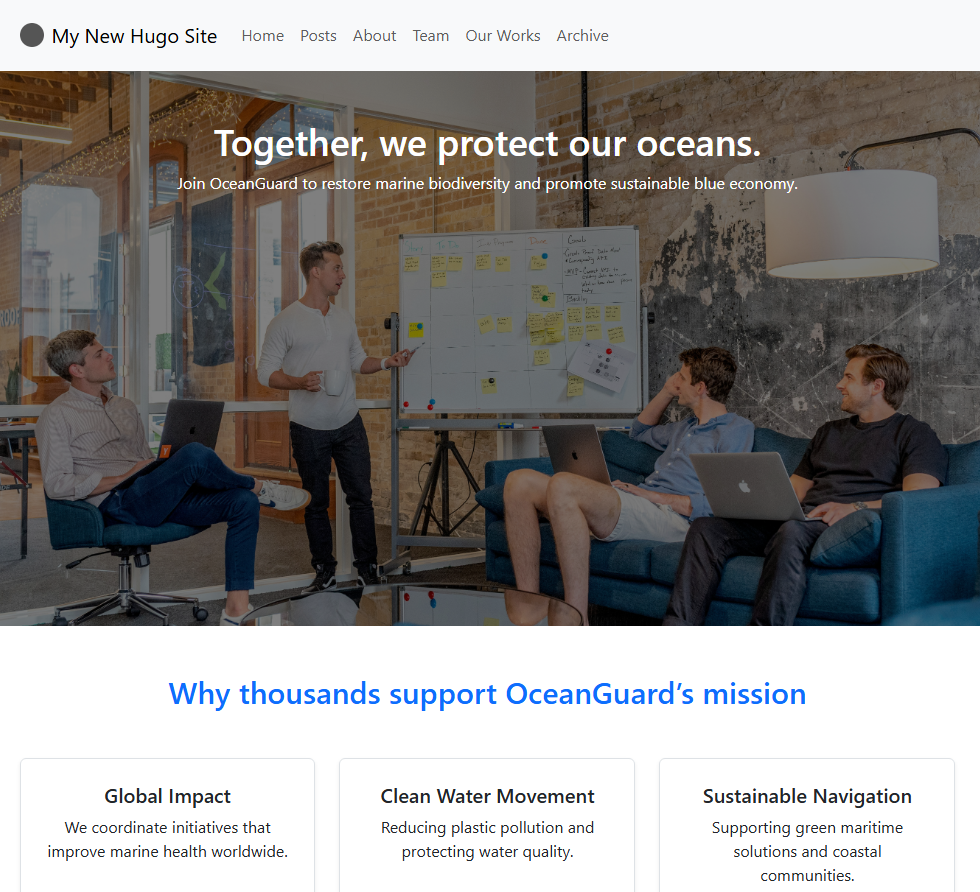

# OrgNest

**OrgNest** is a modern, responsive Hugo theme designed for organizations, teams, and communities. It features a clean layout, content-focused design, and customizable components for blogs, team profiles, portfolios, and more.



## ✨ Features

- 🔹 Modular and minimal layout system
- 📚 Blog and article support with tags & categories
- 👥 Team profiles with social links
- 📦 Portfolio / Our Works showcase
- 📅 Historical timeline section
- 🧠 Search integration (Fuse.js)
- 🌐 i18n-ready and SEO-optimized
- ⚙️ Configurable via `hugo.toml`

---

## 🚀 Installation

### 1. Install the Theme

**Using Git submodule** (recommended):

```bash
git submodule add https://github.com/himadoya/OrgNest themes/OrgNest
```

**Or clone manually:**

```bash
git clone https://github.com/himadoya/OrgNest themes/OrgNest
```

### 2. Enable the Theme

In your site config (`hugo.toml`):

```toml
theme = "OrgNest"
```

---

## ⚙️ Configuration

Here's a minimal `hugo.toml` to get started:

```toml
baseURL = "https://example.org"
languageCode = "en-us"
title = "Your Organization Name"
theme = "OrgNest"

[params]
  description = "Empowering change through collective impact."

  [params.about]
    introTitle = "Welcome to Our Organization"
    introSubtitle = "We empower sustainable impact through innovation and community."

  [params.homeSections]
    showHero = true
    showStats = true
    showTestimonial = true
    showTeam = true
    showTimeline = true

[params.testimonial]
  title = "What Our Seniors Say"
  image = "/images/testimonial.jpg"
  quote = "Joining this organization changed my perspective on teamwork and impact."
  name = "Alexandra"
  role = "Former President"
```

For full configuration options, check the theme's [example-hugo.toml](example-hugo.toml) or the [example-site branch](https://github.com/himadoya/OrgNest/tree/example-site), as well as the documentation (coming soon).

---

## 📂 Repository Structure

Only essential folders are included to keep the theme lightweight:

```
OrgNest/
├── assets/
├── i18n/
├── images/
├── layouts/
├── LICENSE
├── README.md
├── go.mod
├── hugo.toml
└── theme.toml
```

## Roadmap / On Progress
These features are planned or currently in development:
- [] Dark mode toggle
- [] Multilingual support via i18n
- [] Netlify-ready deployment template
- [] Custom shortcode library for easier content creation
- [] Theme settings UI via config/_default/params.toml
- [] Improved accessibility (ARIA labels, semantic HTML)
- [] Enhanced search (support tags, content preview)

---

## 📜 License

OrgNest is licensed under the [MIT License](LICENSE).

---

## 🛠 Author & Credits

Made with ❤️ by [HIMADOYA+](https://himadoya.org)

> Feel free to contribute, report issues, or fork the project.

---